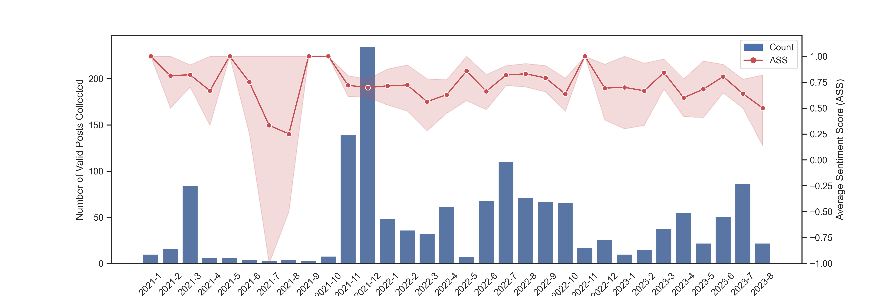

## Introduction

This research delves into the burgeoning world of immersive art exhibitions, exploring what motivates people to attend and how satisfied they are with the experience. While previous studies have focused on the technology behind these exhibitions, this research centers on the attendee, bridging a gap in understanding their motivations and satisfaction.

Building upon existing research on visitor motivations in traditional museums and galleries, this study examines the unique appeal of immersive art exhibitions, considering them as an evolution of traditional art spaces.  By understanding what draws audiences to these new formats, we can gain valuable insights into the future of art engagement.

This research employs a novel dual-methodology approach:

* **Traditional Surveys:**  Measuring eight key motivation factors (novelty, learning, escapism, entertainment, self-expression, personal interest, social interaction, and recommendation) and five corresponding satisfaction factors.
* **Big Data Text Analysis:** Leveraging the power of social media and advanced language models like GPT-4.0 to analyze sentiment and opinions expressed about the Van Gogh immersive art exhibition, a popular and representative example of this art form.

The popular Van Gogh exhibition, having attracted over 5 million visitors, provides a rich dataset for text analysis from platforms like Twitter and Facebook.  This combined approach offers a comprehensive understanding of attendee experience.  Preliminary findings suggest that *novelty* is a primary motivator, and overall satisfaction with the Van Gogh exhibition is high.

## Methodology: A Two-Pronged Approach

This research uses two complementary methods to understand motivations and satisfaction related to the Van Gogh immersive art exhibition: a survey study and social media text analysis.

**Research Questions:**

1. What motivates people to attend the Van Gogh immersive art exhibition?
2. Are attendee expectations met by the exhibition experience?
3. What is the general public's satisfaction with the exhibition, beyond the surveyed participants?

### Survey Study

* **Aim:** To identify motivations for attending the exhibition and assess whether the experience fulfilled attendee expectations.  This study builds on previous research on visitor motivations in various contexts, focusing on the unique aspects of immersive art.
* **Participants:** Adults who attended any Van Gogh immersive art exhibition, recruited primarily through social media platforms.
* **Survey Design:** A multi-item questionnaire focusing on motivations within personal (novelty, learning, escapism, entertainment, self-expression, personal interest) and social (social interaction, recommendation) contexts.  Satisfaction was measured based on corresponding factors, excluding self-expression, personal interest, and recommendation.  A five-point Likert scale was used for responses.
* **Analysis:** Descriptive statistics (means, standard deviations, percentages) were used to analyze responses and correlations between satisfaction factors and overall satisfaction.

### Social Media Text Analysis

* **Data Collection:** Posts from Twitter (January 1, 2021 - August 9, 2023) and Facebook (recent posts) containing keywords related to the Van Gogh exhibition were collected.  Instagram was excluded due to its image-centric nature.

* **Data Cleaning:**  GPT-4.0 was used to classify posts based on relevance (personal experiences, feelings, or opinions).  Manual verification corrected errors in the automated classification.  Only English posts were retained, resulting in 1,428 posts for analysis.
* **Data Analysis:**
    * **Sentiment Analysis:** GPT-4.0 classified posts as positive, neutral, or negative, generating an Average Sentiment Score (ASS) to gauge overall public satisfaction.
    * **Word Cloud Visualization:**  Dominant words and themes within the posts were visualized using word clouds after pre-processing (stop word removal, lemmatization, removal of logistical terms).  [See Appendix for excluded words].

## Results

This section presents the findings from both the survey study and social media text analysis, followed by a discussion of the results, limitations, and ethical considerations.

### Survey Study

* **Demographics:** 66 valid responses were received. The typical attendee is a young (18-24), female, and highly educated (Bachelor's or postgraduate degree). 

* **Motivation Factors:**  Personal motivations were significantly stronger than social ones.
    * **Top Motivations:** Novelty (94.7% agreement), Entertainment (90.9%), and Learning & Improvement (87.9%).   
    * **Least Influential:** Recommendation (61.1%) and, to a lesser extent, Social Interaction (66.2%).

* **Satisfaction Factors:** Overall satisfaction was high (89.4%).
    * **Highest Satisfaction:** Novelty (94%) and Entertainment (90.9%).
    * **Lowest Satisfaction:** Escapism (59.1%).
* **Correlation with Overall Satisfaction:** Novelty and Entertainment showed the strongest positive correlations with overall satisfaction.  All correlations were statistically significant.  Percentage of Satisfied Attendees (PoSA) was highest for Novelty (96%), Entertainment (95%), and Social Interaction (92.4%), and lowest for Escapism (70.3%).

### Social Media Text Analysis:

* **Sentiment Analysis:** GPT-4.0 achieved 94% accuracy in sentiment classification. Overwhelmingly positive sentiment (around 80%) was observed across 2021-2023, with a consistent Average Sentiment Score (ASS) between 0.68 and 0.74.  A slight increase in negative sentiment was observed in 2023.  [Include Figure 3.1: Monthly Sentiment Trends] shows consistent positive sentiment across months, with a dip during the pandemic period.
  

* **Word Cloud Visualization:** Positive sentiment words like "love," "amazing," and "enjoy" dominated the word clouds.  Negative sentiment words like "scam" and "waste" pointed to concerns about value for money.
  

## Discussion

* **Motivation:**  The findings confirm the importance of novelty and entertainment in driving attendance, aligning with previous research on immersive events and museums.  However, personal interest was less influential than expected.  Social motivations, especially recommendations, were less important.  Negative social media comments about excessive advertising support this finding.  The demographic findings suggest a preference for immersive art among young, female, and educated individuals.
* **Satisfaction:**  High overall satisfaction aligns with the positive sentiment from social media analysis.  While novelty and entertainment expectations were met, escapism was less successfully delivered, suggesting a need for improvement in creating a truly immersive and transportive experience.

## Limitations:

* **Survey Study:** Limited sample size, potentially excluding important motivational factors related to the physical context, and lack of detailed satisfaction measures within each factor.
* **Social Media Analysis:** Limited platform selection (Twitter and Facebook) and time range of data, potential residual errors in sentiment classification.

## Ethical Considerations
The research adhered to ethical guidelines, ensuring voluntary and anonymous participation, data privacy, and responsible data handling.  Ethical approval was obtained from the relevant ethics committee.
